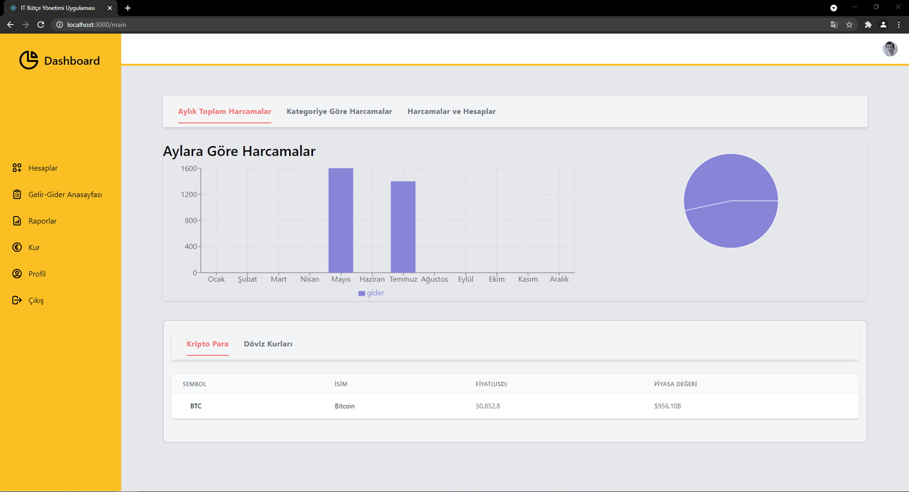
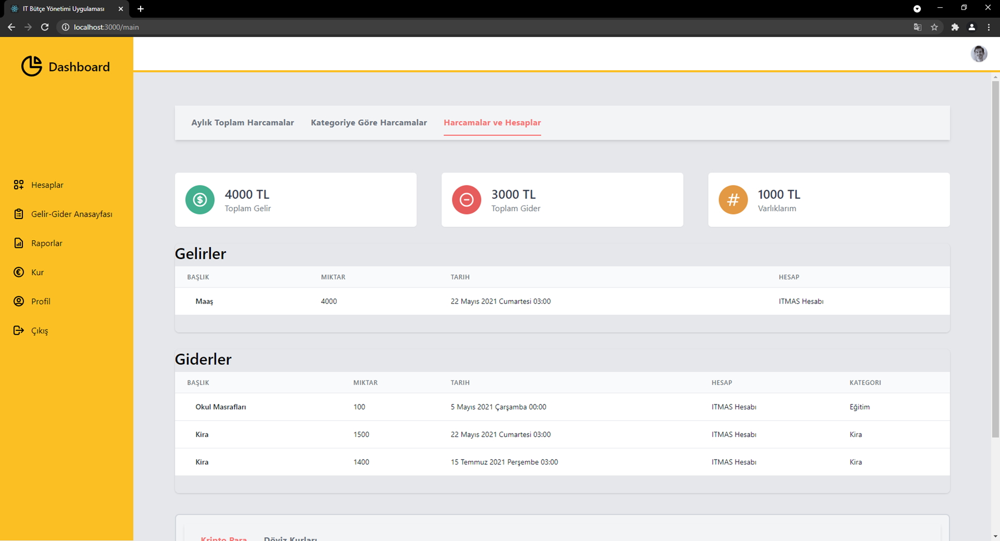
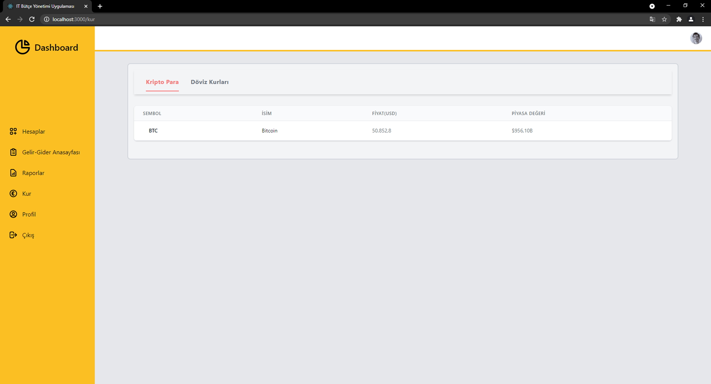
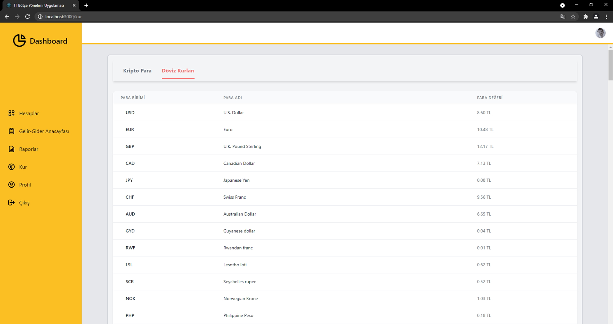
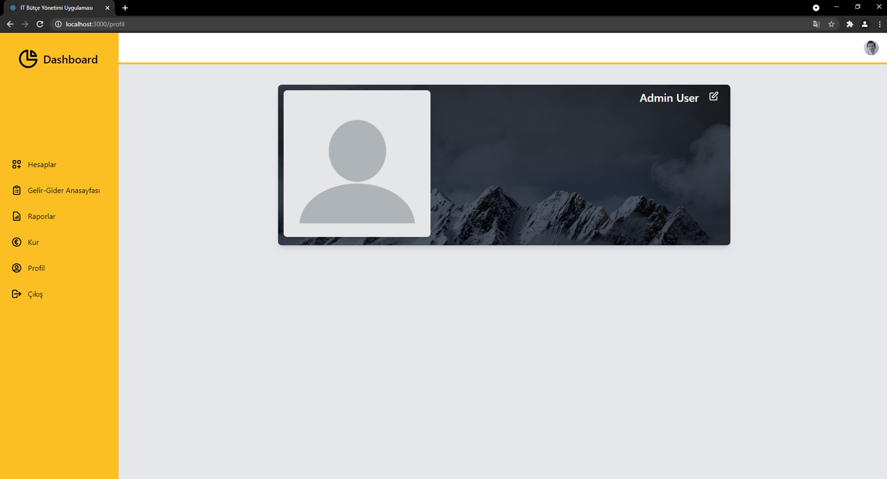

# Butce Yonetimi Web App

The React front end for [Butce Yonetimi API](https://github.com/omerfarukbaysal/ButceYonetimiAPI).

## Table of contents
* [General info](#general-info)
* [Technologies](#technologies)
* [Setup](#setup)
* [Screenshots](#screenshots)

## General info
Income and expense management web application with authentication.
	
## Technologies
Project is created with:
* React 17.0.2
* React Redux 7.2.4
* Tailwind 2.1.2
* Recharts 2.0.9
	
## Setup
To run this project, install it locally using npm:

```
$ cd ../ButceYonetimiWebApp
$ npm install
$ npm start
```

## Screenshots
</img> </img> </img> </img></img> </img> </img> </img></img> </img> </img> 
